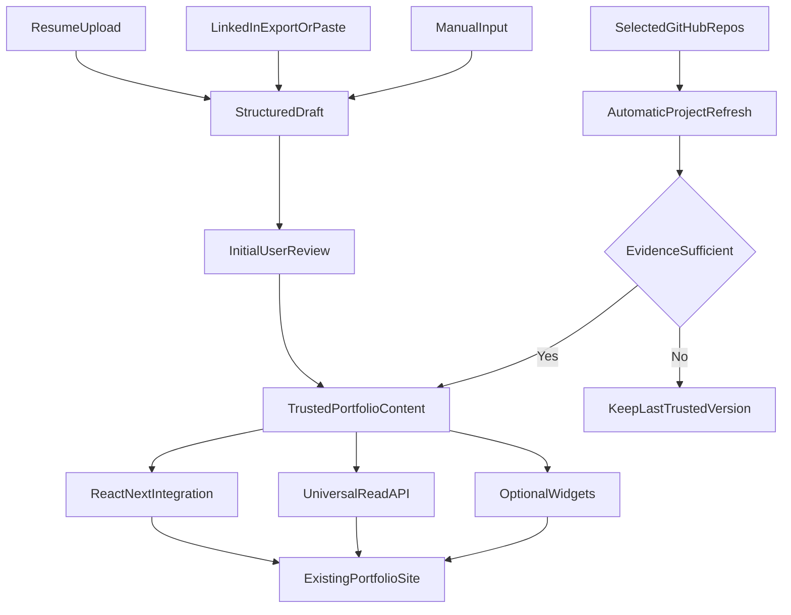
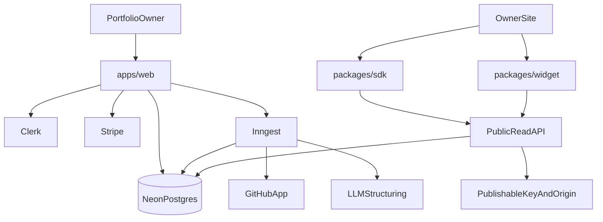
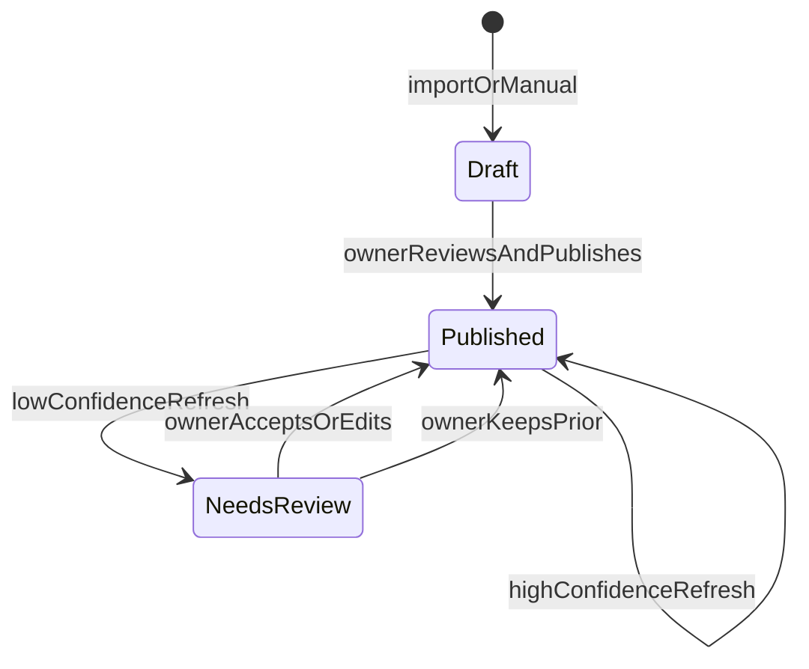

# Por-Kit Portfolio CMS - Plan

## Goal Capsule

- **Objective:** Ship a greenfield Por-Kit SaaS so a developer with an existing React/Next site can import career data, sync selected GitHub projects, and embed live portfolio content in under 15 minutes.
- **Product authority:** Product Contract below (from `ce-brainstorm`). Planning Contract and Implementation Units define HOW without changing product behavior.
- **Product Contract preservation:** Product Contract unchanged.
- **Execution profile:** code · greenfield monorepo · test-first for domain and public API contracts.
- **Open blockers:** None. Placeholder tier numbers and confidence heuristics are assumptions, not product blockers.
- **Stop when:** Definition of Done is met for U1–U7 and Verification Contract commands pass.
- **Sequencing:** U1 → U2 → (U3 ∥ U4) → U5 → U6 → U7. Billing entitlements in U7 may stub free-tier defaults earlier; Stripe gates must be live before claiming paid cadence.

---

## Product Contract

### Summary

Por-Kit will be a hosted portfolio CMS for developers who already have a React or Next.js site.
It will structure imported career data, keep explicitly selected GitHub projects current, and expose the resulting content through guided integrations and optional neutral widgets.

### Problem Frame

Maintaining a detailed personal portfolio currently requires editing content in code, checking that repeated data remains consistent, and redeploying the site.
For the initial user, each update takes roughly 30–60 minutes, so worthwhile changes are delayed or skipped.
The primary problem is ongoing upkeep rather than building the original website.

### Key Decisions

- **Existing-site audience** (session-settled: user-directed — chosen over no-code and site-building audiences: Por-Kit is an embedded CMS, not a website builder). The initial user can paste and configure components in an existing React or Next.js project.
- **Hybrid delivery** (session-settled: user-directed — chosen over API-only, SDK-only, and widget-only delivery: beginners need guidance without losing control). React and Next.js receive the guided path, while a universal API and optional widgets provide escape hatches.
- **Safe LinkedIn import** (session-settled: user-directed — chosen over direct scraping: direct automation is fragile and may violate platform constraints). LinkedIn data enters through user-provided exports or pasted content.
- **Explicit GitHub selection with automatic refresh** (session-settled: user-directed — chosen over one-time or approval-based syncing: upkeep should disappear after intentional inclusion). Only repositories selected by the user are portfolio content.
- **Preserve trusted copy on uncertain AI output** (session-settled: user-directed — chosen over publishing every generation: automation must not invent professional claims). Low-confidence refreshes retain the last published version and alert the user.
- **Product-only pig identity** (session-settled: user-directed — chosen over pig-themed portfolio output: customer portfolios must remain professional and user-controlled). The dashboard, documentation, and marketing use the pig and barnyard theme; published content does not impose it.
- **Capability-based paid plans** (session-settled: user-directed — chosen over record limits, branding removal, and paid-only access: core portfolio management should remain useful for free). Paid value comes from automation frequency, AI enrichment, history, and advanced customization.

### Actors

- A1. **Portfolio owner:** A developer with an existing React or Next.js portfolio who manages sources, content, publication, and credentials.
- A2. **Por-Kit:** The hosted service that structures imports, synchronizes selected projects, preserves published content, and serves it to websites.
- A3. **External sources:** GitHub plus user-provided résumé and LinkedIn-export data.
- A4. **Portfolio visitor:** A reader who sees content rendered by the owner's website or an optional Por-Kit widget.

### Requirements

**Account and content management**

- R1. A portfolio owner can create an account and manage one or more portfolio projects.
- R2. Por-Kit manages profile details, links, projects, work experience, education, and skills.
- R3. A portfolio owner can edit all structured content through the web dashboard.
- R4. The dashboard, documentation, onboarding, and marketing follow a coherent pig and barnyard identity without forcing that identity onto portfolio output.

**Import and synchronization**

- R5. A new user can upload a résumé or LinkedIn export and review the structured draft before first publication.
- R6. Users can enter or correct any content manually.
- R7. Users can connect GitHub and explicitly choose portfolio repositories through supported selection signals.
- R8. Por-Kit automatically refreshes factual fields and generated project copy for selected repositories when their source information changes.
- R9. When an automated refresh lacks sufficient evidence, Por-Kit keeps the last trusted published version and flags the item for review.
- R10. Unselected repositories never appear or update as portfolio projects.

**Website integration**

- R11. React and Next.js users receive a guided integration that connects Por-Kit content to their existing components.
- R12. Users can instead consume framework-neutral structured content or use optional drop-in widgets.
- R13. Widgets and structured content remain visually neutral and customizable by the portfolio owner.
- R14. Read-only website access uses a project-scoped publishable credential with configurable domain controls.
- R15. Documentation explains onboarding, content mapping, credential use, external analytics compatibility, and common integration failures.

**Plans and operations**

- R16. A free plan provides the core account, content-management, publication, and integration experience.
- R17. Paid tiers differentiate through automation frequency, AI enrichment, revision history, and advanced customization rather than basic content-record limits.
- R18. Users can understand their current plan, limits, and upgrade options before an action incurs a restriction.

### Content Flow



### Key Flows

- F1. **Initial portfolio setup**
  - **Trigger:** A1 creates an account and starts a portfolio project.
  - **Actors:** A1, A2, A3.
  - **Steps:** A1 imports a résumé or LinkedIn export, reviews the structured draft, corrects content, connects GitHub, and selects repositories.
  - **Outcome:** Por-Kit holds trusted profile, experience, education, skills, and project content ready for integration.
  - **Covered by:** R1–R7.
- F2. **Website integration**
  - **Trigger:** A1 chooses a framework path in the documentation.
  - **Actors:** A1, A2.
  - **Steps:** A1 creates a publishable credential, configures allowed domains, chooses the guided integration, API, or widget path, and maps content into the site.
  - **Outcome:** The existing portfolio renders Por-Kit content without exposing a secret credential.
  - **Covered by:** R11–R15.
- F3. **Automatic project refresh**
  - **Trigger:** A selected GitHub repository changes.
  - **Actors:** A2, A3.
  - **Steps:** Por-Kit refreshes source facts, regenerates project copy, and evaluates whether the evidence supports publication.
  - **Outcome:** Supported changes publish automatically; uncertain changes preserve the last trusted version and notify A1.
  - **Covered by:** R7–R10.

### Acceptance Examples

- AE1. **Covers R5, R6.**
  - **Given:** A new user uploads a résumé containing profile, experience, education, and skills.
  - **When:** Por-Kit finishes structuring the document.
  - **Then:** The user sees an editable draft and must review it before first publication.
- AE2. **Covers R7, R8, R10.**
  - **Given:** A user has selected one of several GitHub repositories for their portfolio.
  - **When:** Selected and unselected repositories both change.
  - **Then:** Por-Kit refreshes only the selected repository.
- AE3. **Covers R8, R9.**
  - **Given:** A selected repository has trusted published copy.
  - **When:** a later source change does not provide enough evidence for reliable replacement copy.
  - **Then:** The existing copy remains published and the dashboard requests review.
- AE4. **Covers R11, R14, R15.**
  - **Given:** A developer has an existing Next.js portfolio.
  - **When:** They follow the primary documented integration path.
  - **Then:** They can render Por-Kit content using a domain-controlled publishable credential without placing a secret in client code.
- AE5. **Covers R4, R13.**
  - **Given:** A user embeds a Por-Kit widget into a professionally styled portfolio.
  - **When:** The widget renders.
  - **Then:** It adopts user-controlled presentation without visible pig branding by default.

### Success Criteria

- A target user can publish a working project and experience section to an existing React or Next.js site within 15 minutes of account creation.
- Routine changes to a selected GitHub project reach the portfolio without manual source-code edits or redeployment work by the user.
- AI uncertainty never replaces trusted published copy with an unsupported professional claim.
- A user can complete the core import, editing, and integration journey on the free plan.

### Scope Boundaries

**Deferred for later**

- Direct LinkedIn account synchronization, subject to a compliant and reliable access path.
- First-party visitor analytics; v1 supports compatibility with external analytics tools.
- Guided SDKs for frameworks beyond React and Next.js.

**Outside this product's identity**

- Building or hosting complete portfolio websites.
- No-code website creation for users without an existing site.
- Team, agency, or multi-client collaboration.
- Mandatory Por-Kit branding in customer portfolio output.

### Dependencies and Assumptions

- GitHub provides a reliable way to read repositories the user has authorized and intentionally selected.
- Résumé and LinkedIn-export formats contain enough evidence to produce editable structured drafts.
- AI-generated copy can be tied to source evidence and assigned a confidence outcome sufficient to protect the last trusted version.
- External analytics tools can observe the user's rendered site without Por-Kit owning visitor tracking.

### Outstanding Questions

All prior planning-deferred product questions are resolved in the Planning Contract (KTDs and Assumptions). No blocking open questions remain.

---

## Planning Contract

### Key Technical Decisions

- **Greenfield stack** (session-settled: user-directed — chosen over Supabase-first and split backend: keep one Vercel-deployable app surface). Next.js App Router + Neon Postgres + Stripe + Clerk.
- **Clerk for dashboard auth** (session-settled: user-directed — chosen over Better Auth on Neon: ship speed for greenfield SaaS). Store `clerkUserId` on the local user row; do not use Clerk as the content store.
- **Drizzle ORM + Drizzle Kit** — Neon-native serverless driver; pooled URL for app traffic, direct URL for migrations.
- **Inngest for durable jobs** — résumé parse, GitHub sync, AI enrichment, and plan-gated cron cadence run outside request timeouts.
- **GitHub App for repo sync** — installation-scoped tokens and webhooks; separate from Clerk “Sign in with GitHub” if used for login.
- **Repo selection** — dashboard multi-select is authoritative; pinned repos and topic `portfolio` are discovery helpers only (never auto-publish alone).
- **Publishable keys** — `pk_…` read-only keys with Origin/Referer allowlist, per-key rate limits, and instant revoke; secret keys never ship to browsers.
- **AI confidence gate** — publish generated prose only when source evidence includes a README or description plus at least one corroborating factual field; otherwise keep last trusted published version and flag for review.
- **v1 widgets** — projects and experience only; CSS-variable theming; no pig branding on embed output.
- **Tier placeholders** — Free: full core journey, daily sync, capped AI enrichments/month, no revision history. Paid: hourly sync, higher AI cap, 30-day revision history, advanced key/domain customization. Exact numbers live in config and can change without product-scope change.
- **Monorepo packages** — `apps/web` (dashboard, docs, marketing, API routes) + `packages/sdk` (React/Next helpers) + `packages/widget` (embed script) + `packages/shared` (schemas/types).

### High-Level Technical Design





### Assumptions

- Deploy target is Vercel; Node runtime for parse/LLM jobs (not Edge for PDF/DOCX).
- LLM provider is chosen at implementation (OpenAI or Anthropic) with Zod-validated structured output.
- Résumé PDF uses layout-aware extraction where feasible; DOCX via mammoth; LinkedIn export is ZIP/CSV/paste.
- Origin allowlists deter casual abuse but are not cryptographic secrets; rate limits and revoke are required.
- Free-tier AI/sync caps are soft product levers; abuse protection uses rate limits + Stripe entitlements checked inside Inngest handlers.

### Output Structure

```text
apps/web/                 # Next.js App Router: marketing, docs, dashboard, API
packages/sdk/             # @porkit/sdk React/Next helpers
packages/widget/          # embeddable projects + experience widgets
packages/shared/          # Zod schemas, content types, plan entitlements
drizzle/                  # schema + migrations
```

### Scope Boundaries (implementation)

**Deferred to Follow-Up Work**

- Vue/Svelte guided SDKs.
- Additional widget section types (education, skills, full profile card).
- First-party analytics dashboards.
- Multi-portfolio org/team features.

### Risks and Mitigations

- **Serverless timeouts on parse/sync** — all heavy work in Inngest steps; upload route only enqueues.
- **Neon connection exhaustion** — pooled URL + `prepare: false` pattern; migrate via direct URL.
- **AI hallucination** — confidence gate + last-trusted preserve (R9 / AE3).
- **Publishable key scraping** — domain allowlist + rate limit + revoke; never treat `pk_` as secret.
- **GitHub permission creep** — least-privilege App permissions; only selected repos sync.
- **Stripe entitlement races** — webhook updates local plan state before gated jobs proceed.

### Sources and Research

- Neon Drizzle / serverless driver guidance; GitHub Apps vs OAuth Apps docs.
- Inngest durable steps for multi-step AI/sync pipelines.
- Publishable-key + Origin allowlist patterns (browser-safe read credentials).
- Resume parsing: mammoth for DOCX; layout-aware PDF extract before LLM structuring.

---

## Implementation Units

### U1. Monorepo foundation and pig-themed shell

- **Goal:** Bootstrap the greenfield monorepo with Next.js, Neon/Drizzle, Clerk, Inngest stubs, and pig/barnyard themed marketing + authenticated app chrome.
- **Requirements:** R1, R4
- **Dependencies:** None
- **Files:** `package.json`, `pnpm-workspace.yaml`, `apps/web/**`, `packages/shared/**`, `drizzle/schema.ts`, `drizzle.config.ts`, `.env.example`, `apps/web/app/(marketing)/**`, `apps/web/app/(dashboard)/layout.tsx`, `apps/web/__tests__/smoke.test.ts`
- **Approach:** Create workspace; wire Clerk middleware for dashboard routes; establish CSS variables for pig/barnyard product theme; leave public portfolio output paths theme-neutral. Prove Neon connectivity and a signed-in empty dashboard.
- **Execution note:** Prefer install/runtime smoke for scaffolding; add one smoke test that the app boots and protected routes redirect when unsigned.
- **Test scenarios:**
  - Unsigned visitor hitting `/dashboard` is redirected to sign-in.
  - Signed-in user reaches an empty dashboard shell with pig-themed chrome.
  - Marketing home loads without requiring auth.
- **Verification:** Local app runs; Clerk sign-in works; Drizzle can migrate against Neon; smoke test passes.

### U2. Portfolio content model and dashboard CRUD

- **Goal:** Persist and edit profile, links, projects, experience, education, and skills with draft vs published states.
- **Requirements:** R1–R3, R6; F1
- **Dependencies:** U1
- **Files:** `drizzle/schema.ts`, `apps/web/app/(dashboard)/portfolio/**`, `apps/web/lib/content/**`, `apps/web/__tests__/content-crud.test.ts`, `packages/shared/src/content-schema.ts`
- **Approach:** Portfolio belongs to Clerk-linked user. Content entities support draft and published snapshots. Manual create/edit/delete covers all R2 fields. First publication requires leaving draft review when content originated from import (enforced with U3).
- **Execution note:** Implement domain writes test-first against shared Zod schemas.
- **Test scenarios:**
  - Creating experience and project records persists and reloads in the dashboard.
  - Editing a published item updates draft then publish promotes it.
  - Deleting an item removes it from subsequent reads.
  - Unauthorized user cannot mutate another user's portfolio.
- **Verification:** CRUD happy path and authz failure covered by tests; dashboard edits round-trip.

### U3. Résumé and LinkedIn-export import pipeline

- **Goal:** Upload résumé or LinkedIn export, structure into draft content, and require review before first publication.
- **Requirements:** R5, R6; F1; AE1
- **Dependencies:** U2
- **Files:** `apps/web/app/api/imports/**`, `apps/web/lib/import/**`, `apps/web/inngest/functions/import-resume.ts`, `apps/web/__tests__/import-pipeline.test.ts`
- **Approach:** Upload stores file; Inngest job extracts text (DOCX/PDF/export), LLM+Zod maps to shared content schema, writes draft only. UI shows review checklist; publish blocked until owner confirms. Manual corrections always allowed.
- **Execution note:** Start with a failing integration test for AE1 (draft + review gate).
- **Test scenarios:**
  - Covers AE1. Valid résumé upload yields editable draft and blocks publish until review confirmation.
  - Corrupt/unsupported file fails the job with a user-visible error and leaves content unchanged.
  - LinkedIn export paste/file produces draft experience and profile fields when present.
  - After review confirmation, publish succeeds and public draft gate clears.
- **Verification:** AE1 automated; import failure path covered; no auto-publish of fresh imports.

### U4. GitHub App connect, selection, and sync

- **Goal:** Connect a GitHub App installation, let owners select repos, and auto-refresh only selected repos on webhook/cron.
- **Requirements:** R7, R8, R10; F3; AE2
- **Dependencies:** U2
- **Files:** `apps/web/app/api/github/**`, `apps/web/lib/github/**`, `apps/web/inngest/functions/github-sync.ts`, `apps/web/__tests__/github-sync.test.ts`
- **Approach:** Installation OAuth/callback stores installation id. Dashboard lists repos; selection writes `selected_repos`. Pins and topic `portfolio` appear as suggested picks only. Webhooks and plan-gated cron enqueue sync for selected repos only. Factual fields (name, url, language, topics, description, stars) update from GitHub; prose goes through U5.
- **Execution note:** Test-first for selection isolation (AE2).
- **Test scenarios:**
  - Covers AE2. Selected repo change syncs; unselected sibling change does not create/update portfolio projects.
  - Disconnecting GitHub stops further sync jobs for that portfolio.
  - Webhook for non-selected repo is ignored.
  - Missing GitHub permissions surfaces a recoverable dashboard error.
- **Verification:** AE2 covered; only selected repos mutate portfolio projects.

### U5. AI enrichment and confidence gate

- **Goal:** Generate project copy from GitHub evidence and preserve last trusted version when confidence is low.
- **Requirements:** R8, R9; F3; AE3
- **Dependencies:** U4
- **Files:** `apps/web/lib/ai/**`, `apps/web/inngest/functions/enrich-project.ts`, `packages/shared/src/confidence.ts`, `apps/web/__tests__/confidence-gate.test.ts`
- **Approach:** Enrichment job builds an evidence bundle (README, description, languages, topics). High confidence publishes new prose + facts. Low confidence updates facts only if safe, keeps prior prose, sets `needs_review`, notifies owner. Paid revision history stores prior published snapshots when entitlement allows.
- **Execution note:** Implement confidence pure function test-first, then job integration.
- **Test scenarios:**
  - Covers AE3. Low-evidence refresh keeps prior published prose and flags needs_review.
  - High-evidence refresh replaces prose and clears needs_review.
  - Owner accepting a flagged draft publishes the new prose.
  - Free plan skips history retention; paid plan stores a prior snapshot on publish.
- **Verification:** AE3 covered; no path publishes unsupported claims over trusted copy.

### U6. Publishable keys and public read API

- **Goal:** Issue project-scoped publishable keys with domain controls and serve read-only portfolio JSON.
- **Requirements:** R12, R14; F2; AE4
- **Dependencies:** U2
- **Files:** `apps/web/app/api/v1/**`, `apps/web/lib/keys/**`, `apps/web/app/(dashboard)/keys/**`, `apps/web/__tests__/public-read-api.test.ts`
- **Approach:** Create/revoke `pk_` keys with allowlisted origins. Public GET endpoints return published content only. Reject missing/mismatched Origin for browser traffic; apply rate limits. Secret server keys optional for non-browser server fetches but never required for the beginner path.
- **Execution note:** Contract tests for allowlist accept/reject before wiring SDK.
- **Test scenarios:**
  - Covers AE4. Valid key + allowed Origin returns published projects/experience.
  - Valid key + disallowed Origin is rejected.
  - Revoked key is rejected.
  - Draft-only content never appears on public read endpoints.
- **Verification:** AE4 contract tests green; dashboard can create and revoke keys.

### U7. React/Next SDK, widgets, docs, and Stripe entitlements

- **Goal:** Ship guided SDK + optional neutral widgets + docs, and gate automation/AI/history via Stripe plans.
- **Requirements:** R11–R13, R15–R18; F2; AE4, AE5
- **Dependencies:** U5, U6
- **Files:** `packages/sdk/**`, `packages/widget/**`, `apps/web/app/(marketing)/docs/**`, `apps/web/app/api/stripe/**`, `apps/web/lib/billing/**`, `apps/web/__tests__/entitlements.test.ts`, `packages/sdk/__tests__/client.test.ts`
- **Approach:** SDK helpers fetch via publishable key and expose typed hooks/components for mapping into user components. Widget script renders projects/experience with CSS variables and no pig branding (AE5). Docs cover 15-minute path, credential use, analytics “bring your own,” and failure modes. Stripe Checkout + Customer Portal + webhooks update entitlements; Inngest cron cadence and AI caps read entitlements; UI warns before a limit blocks an action (R18).
- **Execution note:** SDK client tests against mocked public API; entitlement checks unit-tested; widget branding assertion for AE5.
- **Test scenarios:**
  - Covers AE4. SDK fetch with publishable key returns typed published content.
  - Covers AE5. Widget markup/CSS contains no pig/barnyard brand tokens by default.
  - Free plan exceeding AI cap blocks enrichment and shows upgrade CTA before the action.
  - Paid plan enables hourly sync cadence entitlement.
  - Stripe webhook upgrades plan and subsequent gated action succeeds.
- **Verification:** Docs describe the primary Next path; SDK/widget packages build; billing entitlement tests pass; AE4/AE5 covered.

---

## Verification Contract

| Gate | Command / proof | Applies |
|---|---|---|
| Unit + integration tests | `pnpm test` (workspace) | Every feature unit U2–U7 |
| Typecheck | `pnpm typecheck` | Before merge |
| Lint | `pnpm lint` | Before merge |
| AE regression focus | Tests tagged/named for AE1–AE5 | Release candidate |
| Manual smoke | Sign up → import → select repo → create `pk_` → render via SDK in a sample Next app | Before calling 15-minute success met |
| Billing smoke | Stripe test-mode checkout + webhook updates entitlements | Before paid-tier claims |

Greenfield note: until `package.json` scripts exist, U1 establishes these script names; later units must keep them working.

---

## Definition of Done

**Global**

- Product Contract R1–R18 are implemented or explicitly deferred with rationale already in Scope Boundaries.
- AE1–AE5 have automated coverage.
- Free-plan user can complete import → edit → key → SDK embed without paying.
- Pig theme appears only on Por-Kit product surfaces; public API/widget output is neutral.
- No secret API keys required in browser bundles for the beginner path.
- Verification Contract gates pass on main.

**Per unit**

- U1: Monorepo boots with Clerk + Neon + themed shell.
- U2: Full content CRUD with draft/publish.
- U3: Import → draft → review gate (AE1).
- U4: GitHub select + sync isolation (AE2).
- U5: Confidence preserve (AE3).
- U6: Publishable key public read (AE4).
- U7: SDK, widgets, docs, Stripe entitlements (AE4/AE5, R16–R18).
